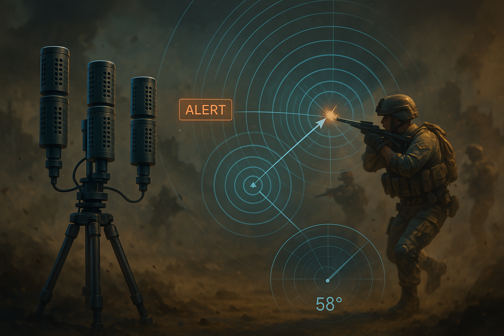

# 🎯 Gunshot_Direction_Detection_System

This repository contains the project files and design flow for the **Microphone array-based direction of arrival (DoA) gunshot detection system**, developed as part of **Smart India Hackathon 2024** – Problem Statement ID: **SIH1651**.

  

---

## 📁 Files and Components

### `fpga_audio_processing.v`
- Core logic implemented for signal filtering and delay estimation using **FPGA**.
- Computes **TDOA (Time Difference of Arrival)** to determine angle.

### `mic_array_simulation.m`
- MATLAB simulation for microphone array geometry and signal modeling.
- Plots sound wave propagation and delay curves.

### `gunshot_sample.mp3`
- Test audio used for system evaluation.
- Used in simulations to verify DoA estimation algorithms.

### `direction_display_ui.fig`
- A basic UI mockup in Figma.
- Illustrates how direction of the gunshot is displayed in real-time.

---

## 🔧 Technologies Used

- **FPGA** – Signal processing and real-time DoA estimation.
- **MATLAB** – Algorithm development and acoustic modeling.
- **Figma** – UI design for the directional alert display.
- **MP3 Samples** – Realistic input for testing and simulation.

---

## 🧪 Project Features

- Detects the **origin direction** of a gunshot in real-time.
- Designed for high-speed **military and border security applications**.
- Supports modular microphone array setups.
- Potential use in **smart surveillance**, **public safety**, and **defense**.

---

## 📚 References

- [Object tracking using TDOA (MathWorks)](https://www.mathworks.com/help/fusion/ug/object-tracking-using-time-difference-of-arrival.html)
- [Spectral Analysis in MATLAB](https://www.mathworks.com/help/matlab/math/basic-spectral-analysis.html)
- [Acoustic Gunshot Detection Thesis (UPC)](https://upcommons.upc.edu/bitstream/2117/344221/2/TFG-Carlos_Vidal.pdf)

---

## 🧑‍💻 Team Arise – SIH 2024
Developed for Smart India Hackathon under the theme **Miscellaneous**, PS Category: **Software**.
